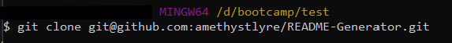
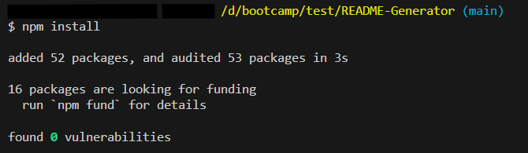
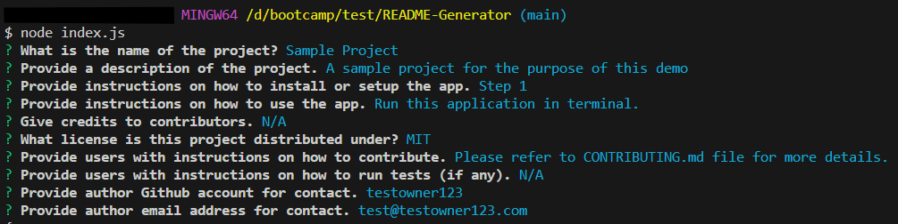

# Professional README Generator

    
## Description
    
This tool was designed to help developers to quickly and easily generate a README file by using a command-line application.
    
## Table of Contents
    
- [Installation](#installation)
- [Usage](#usage)
- [Credits](#credits)
- [License](#license)
- [How to Contribute](#how-to-contribute)
- [Tests](#tests)
- [Questions](#questions)
    
## Installation
    
1.Clone this Git repo to your local directory. 
 
2.Open the repo folder in VS Studio or your preferred code editor. 
3.Open the Integrated Terminal and enter command `npm install` to download the required Inquirer package. 

## Usage
    
Once the dependencies have been installed, you can invoke the application with command `node index.js` in the terminal. Follow the prompts to answer each question. The responses provided by the user will be recorded and saved into a README(project title).md file, located under the "generated_files" directory. For more detailed instructions, please watch the [walkthrough video](https://drive.google.com/file/d/136NRMjKFm9Y9jTo3piOK7BpPluPT9VCT/view?usp=sharing). 

    
## Credits
    
Badges are made with Shields.io(https://shields.io/badges).

## License
 
This project is licensed under the MIT License - see the [LICENSE.md](license) file for details    
 
## How to Contribute
    
Feel free to contribute your ideas or bug fixes for this project by raising a new issue or new pull request.
    
## Tests
    
N/A
    
## Questions
Repository contact: [@amethystlyre](https://github.com/amethystlyre)  
If you have any questions or issues relating to this project, you can raise it in a New Issue and tag the repo owner. 
Alternatively you can also contact the owner via [email](test@example.com).
